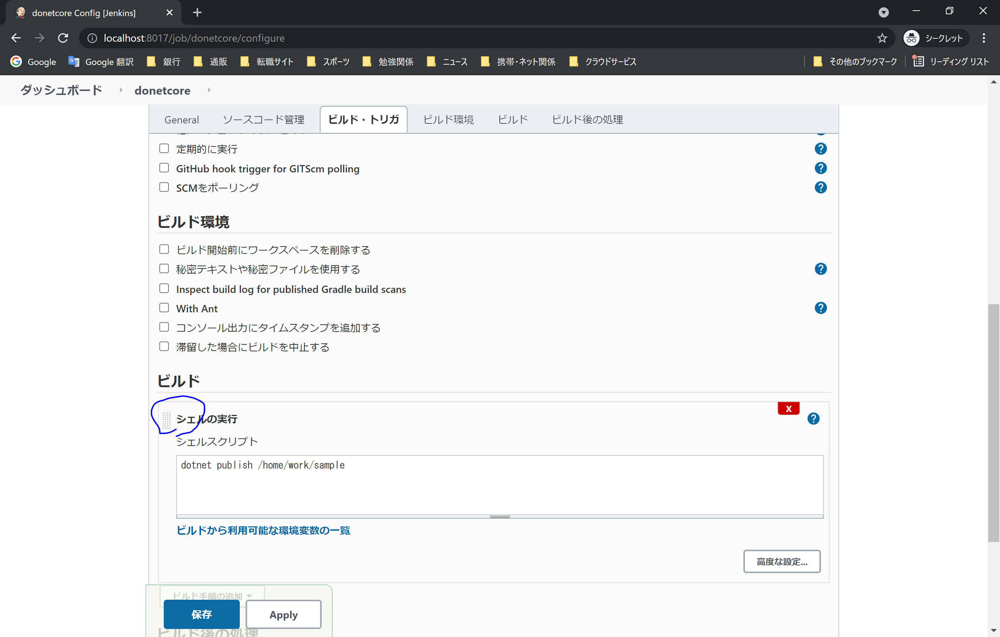
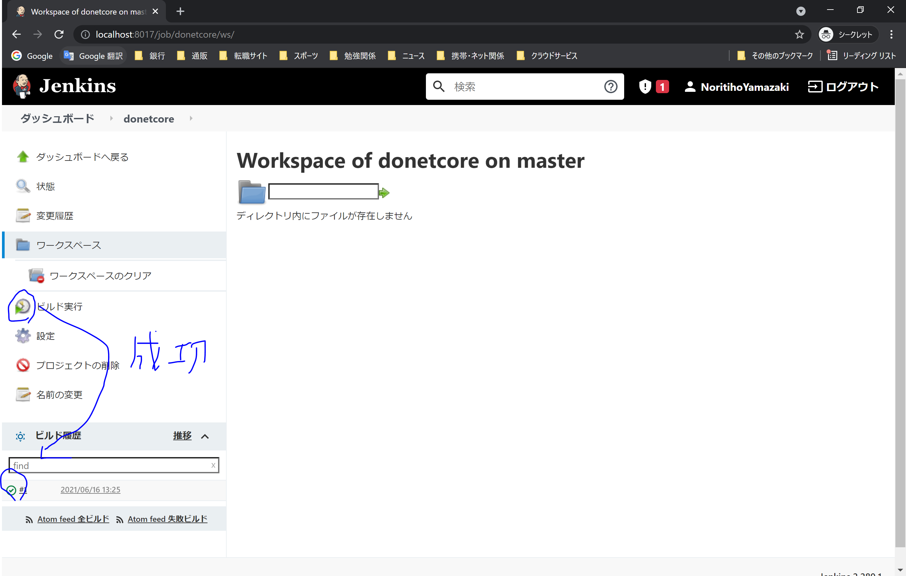

### jenkinsの単純起動

``` bash
docker run -itd -p 8080:8080  jenkins/jenkins:lts
``` 


### docker-compose 起動
私が使うのに必要なもののみ設定しています。


*docker-jenkins-url*
http://localhost:8017/

``` bash
docker-compose up -d 

docker exec -it -u root jenkins_docker bash

# root 実行
# https://docs.microsoft.com/ja-jp/dotnet/core/install/linux-debian
/home/work$ wget https://packages.microsoft.com/config/debian/10/packages-microsoft-prod.deb -O packages-microsoft-prod.deb
/home/work$  dpkg -i packages-microsoft-prod.deb
/home/work$ apt-get update; \
            apt-get install -y apt-transport-https && \
            apt-get update && \
            apt-get install -y dotnet-sdk-5.0
/home/work$ exit

docker-compose exec jenkins_docker bash
# jenkins 実行 
/home/work$ dotnet --version
/home/work$ dotnet new console --output sample1
/home/work$ dotnet run --project sample1
/home/work$ exit
/home/work$ cat /var/jenkins_home/secrets/initialAdminPassword
``` 

☆設定


☆実行


