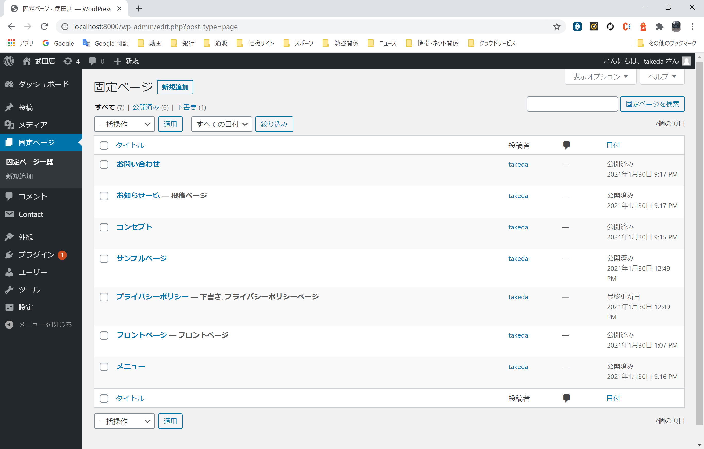
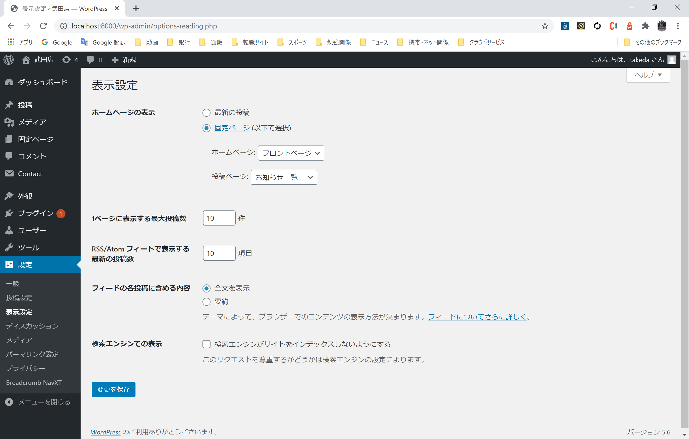
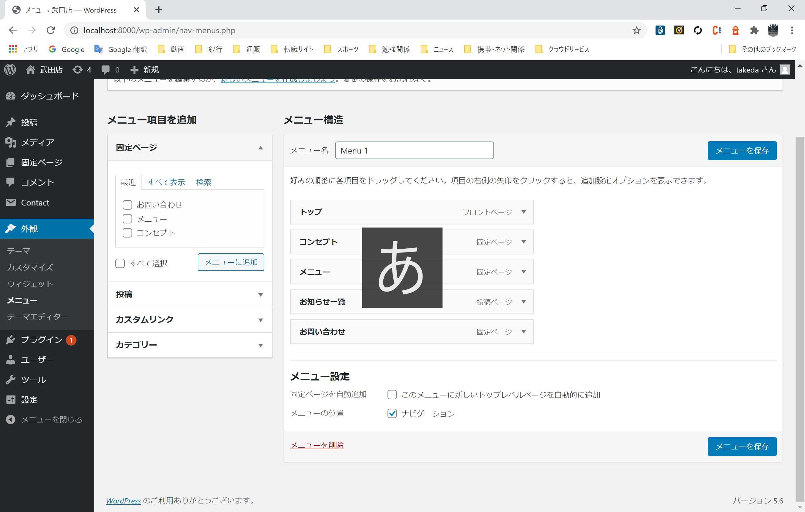

1. docker-compose 立ち上げ
2. http://{domain}:{port}/wp-admin/  にアクセス
   1. DB設定
   2. ログインアカウント設定
3. テーマをDL
   1. http://inomacreate.com/wordpress-inomarestaurantbasic/
4. Wordpress管理画面
   1. テーマ設定
      1. テーマインスト
   2. プラグイン追加
       1. Contact Form 7
       2. [breadcrumb-navxt](https://ja.wordpress.org/plugins/breadcrumb-navxt/#installation)
       3. .htaccess ファイルに追記
        ```php
         <IfModule mod_rewrite.c>
         RewriteEngine On
         RewriteRule .* - [E=HTTP_AUTHORIZATION:%{HTTP:Authorization}]
         RewriteBase /
         RewriteRule ^index\.php$ - [L]
         RewriteCond %{REQUEST_FILENAME} !-f
         RewriteCond %{REQUEST_FILENAME} !-d
         RewriteRule . /index.php [L]
         </IfModule>
        ```
       4. 固定ページの作成
          1. メニュー
          2. コンタクト
          3. お知らせ
          4. コンセプト
           
       5. 設定 表示設定
          1. 下記の通りに設定
           
       6. 外観 ＞メニュー
          1. メニューの設定を下記のように行う
             1. フロントページ→TOP にラベルを変更
             2. 並び替え
           
            
        